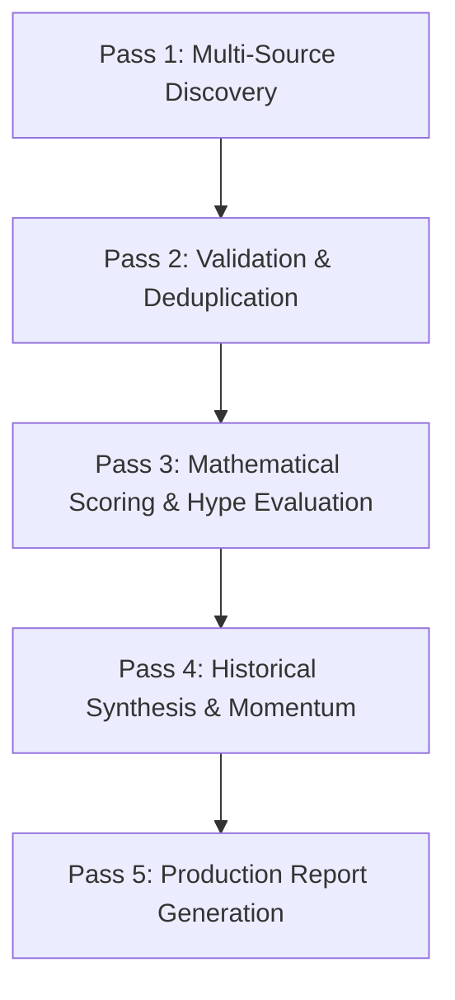

# Daily Tech Trend Intelligence System

A production-grade, multi-source, multi-signal, evidence-based technology intelligence skill. Designed to answer two decisive questions every single day:

1. **"What critical shifts, releases, and discussions are happening across the Internet technology ecosystem today?"**
2. **"Which emerging technology or trend, if mastered and deployed right now, provides an asymmetric competitive advantage for project building, career acceleration, and monetization?"**

---

## 1. Operating Principles & Anti-Hallucination Mandate

- **Honesty Over Completeness:** If an external source (e.g. LinkedIn, closed API) cannot be directly accessed during a run, explicitly record: `"[Source] could not be directly verified in this run."` Never fabricate synthetic metrics or social proof.
- **Evidence Triangulation:** A confirmed trend must be validated across at least **two independent sources** (e.g. GitHub commit + Hacker News discussion, or Official Docs + Reddit community thread).
- **Hype vs. Utility Separation:** Every candidate is scored across two divergent axes: **Hype Score (0–100)** and **Practical Value Score (0–100)**. Never mistake influencer engagement-bait for authentic engineering traction.
- **Deduplication:** Multiple publications reporting the same news release are clustered into a single underlying event.

---

## 2. Priority Matrix & Taxonomy

### Priority 1 — Core Focus Areas (MANDATORY: Never Skip)

| Core Area | Focus Domains | Daily Mandatory Requirement |
| :--- | :--- | :--- |
| **1. AI Automation** | Autonomous agents, agentic workflows, multi-agent orchestration, MCP (Model Context Protocol), browser agents, computer-use agents, tool/function calling, memory, planning, evaluation, E2B sandboxes. | Minimum 2 verified signals every run. |
| **2. Telegram Bots** | Telegram Bot API updates, Mini Apps (TMA/TWA), Telegram Stars monetization, Python frameworks (Aiogram 3, Pyrogram), WebApp authentication, payment webhooks, bot security, MTProto. | Minimum 2 verified signals every run. |
| **3. Web Development** | Modern frontend/backend, React 19, Next.js 15, Vite, TypeScript, Bun, RSC, Server Actions, WebGPU, WebAssembly, PostgreSQL/pgvector, Redis, Cloudflare Workers, edge computing. | Minimum 2 verified signals every run. |

### Priority 2 — High-Value Engineering & Infrastructure
- **AI Engineering / AI Systems:** LLM inference (vLLM, Ollama), RAG, vector databases, model fine-tuning (LoRA), MLOps.
- **Software Engineering:** System design, microservices, API architecture, testing (Vitest, Playwright), CI/CD.
- **Cybersecurity & AI Security:** API security, Linux hardening, prompt injection defense, agent firewalls, red teaming.
- **Cloud Computing & DevOps/SRE:** Kubernetes, Docker, Terraform, AWS/GCP/Cloudflare, OpenTelemetry, site reliability.

### Priority 3 — Deep Foundations & Extended Horizons
- Computer Science Fundamentals (DSA, OS, Networks)
- Distributed Systems (Consensus protocols, high-availability caching)
- Data Engineering (Kafka, Spark, Iceberg, DuckDB)
- Robotics, Embedded Systems & Edge AI (ESP32, ROS2, edge vision)
- AI + Industry Verticals & Technical Leadership

---

## 3. The 5-Pass Intelligence Pipeline

When executing a daily research run, the system proceeds through 5 distinct passes:



### Pass 1: Multi-Source Discovery
- Scan primary feeds:
  - **Hacker News:** Firebase API (`/topstories`, `/showstories`)
  - **GitHub:** Search API (`topic:ai-agent`, `topic:telegram-mini-app`, `topic:mcp-server`, `topic:webgpu`)
  - **Reddit:** Developer subreddits (r/LocalLLaMA, r/programming, r/webdev, r/Telegram, r/SaaS)
  - **Lobste.rs:** Direct JSON story stream
  - **Official Portals:** OpenAI, Anthropic, Google DeepMind, Telegram Bot API, Vercel Changelogs
- Refer to: [prompts/discovery.md](./prompts/discovery.md) and [references/query_playbook.md](./references/query_playbook.md).

### Pass 2: Validation & Deduplication
- Filter out spam, fake GitHub star farms, and SEO regurgitations ([references/anti_patterns.md](./references/anti_patterns.md)).
- Cluster duplicate press releases into single canonical events.
- Verify creation date (must be within the 24h–72h window).
- Refer to: [prompts/validation.md](./prompts/validation.md).

### Pass 3: Mathematical Scoring & Hype Evaluation
- Calculate the **100-Point Trend Score**:
  - Recency: 15 pts
  - Cross-Platform Mentions: 15 pts
  - Growth Velocity: 15 pts
  - Developer Interest: 10 pts
  - Search Momentum: 10 pts
  - GitHub Momentum: 10 pts
  - Social Engagement: 5 pts
  - Official Confirmation: 5 pts
  - Real-World Adoption: 5 pts
  - Business Impact: 5 pts
- Multiply by **1.15x** for Core Areas (AI Automation, Telegram, Web Dev).
- Compute **Hype Score** vs. **Practical Value Score** (0–100 each).
- Classify into status: 🔥 *Exploding*, 🚀 *Rising*, 👀 *Emerging*, 🧠 *Important*, 🏢 *Industry Shift*, 🛠 *Developer Opportunity*, ⚠️ *Security Alert*, 📉 *Fading*.
- Refer to: [prompts/scoring.md](./prompts/scoring.md) and [config/scoring.yaml](./config/scoring.yaml).

### Pass 4: Historical Synthesis & Momentum Tracking
- Read `data/historical/trend-history.json`.
- Compute momentum: $\Delta S = S_{\text{today}} - S_{\text{yesterday}}$.
- Compute acceleration: $\Delta V = \Delta S_t - \Delta S_{t-1}$.
- Save daily snapshot to `data/trends/YYYY-MM-DD.json`.
- Refer to: [prompts/synthesis.md](./prompts/synthesis.md).

### Pass 5: Final Report & Build Opportunities
- Synthesize into the standardized daily markdown report.
- Formulate 5–10 structured project opportunities ([references/build_opportunities_matrix.md](./references/build_opportunities_matrix.md)).
- Formulate the 5-Minute Executive Summary.
- Refer to: [prompts/report.md](./prompts/report.md).

---

## 4. Execution Commands

### Automated CLI Execution
You can run the built-in automated intelligence scout at any time:

```bash
# Run full daily intelligence pipeline and save report
python3 scripts/trend_scout.py run-all --output data/reports/report-$(date +%F).md

# Inspect historical trajectories and momentum
python3 scripts/trend_scout.py history --limit 15
```

### Agent Manual Execution
If executing as an LLM agent without the automated script:
1. Follow the exact instructions in `prompts/discovery.md` to search across Google, Hacker News, Reddit, and GitHub.
2. Cross-check against `references/anti_patterns.md`.
3. Apply the scoring matrix in `config/scoring.yaml`.
4. Output the standardized format specified in `prompts/report.md`.

---

## 5. Directory Structure Reference

```text
daily-tech-trend-intelligence/
├── SKILL.md                          # Master specification (this file)
├── README.md                         # Installation & GitHub guide
├── config/                           # Configurable rules
│   ├── topics.yaml                   # Taxonomy & query keywords
│   ├── sources.yaml                  # Feed endpoints & reliability weights
│   └── scoring.yaml                  # 100-pt scoring formula weights
├── prompts/                          # 5-pass operational prompts
│   ├── discovery.md                  # Pass 1: Multi-source discovery
│   ├── validation.md                 # Pass 2: Validation & deduplication
│   ├── scoring.md                    # Pass 3: Mathematical scoring
│   ├── synthesis.md                  # Pass 4: Historical momentum
│   └── report.md                     # Pass 5: Final output template
├── sources/                          # Platform-specific playbooks
│   ├── github.md                     # GitHub star velocity & repo analysis
│   ├── hackernews.md                 # HN Firebase & Algolia discovery
│   ├── reddit.md                     # Developer subreddit RSS feeds
│   ├── x_twitter.md                  # Real-time dev chatter & breaking news
│   ├── youtube.md                    # View-to-age ratio & tutorial analysis
│   ├── producthunt.md                # New product launches
│   ├── google_trends.md              # Breakout query analysis
│   ├── tech_news.md                  # Tech media & PR filter
│   └── official_sources.md           # Engineering changelogs
├── references/                       # In-depth operational guides
│   ├── taxonomy.md                   # Full 3-tier taxonomy details
│   ├── signals_guide.md              # 12-signal evaluation rubrics
│   ├── anti_patterns.md              # Anti-hype & fake trends filtering
│   ├── build_opportunities_matrix.md # 10-dimension project idea matrix
│   └── query_playbook.md             # Advanced search queries & operators
├── scripts/                          # Python CLI & analysis engine
│   ├── trend_scout.py                # Main orchestrator CLI
│   ├── fetchers/                     # Network collectors (HN, GitHub, Reddit, etc.)
│   ├── engine/                       # Classifier, Scorer, Deduplicator, History
│   └── generators/                   # Report generator & Build ideator
├── data/                             # Persistent database
│   ├── trends/                       # Daily JSON snapshots (YYYY-MM-DD.json)
│   └── historical/                   # trend-history.json & radar_watch.json
└── examples/
    ├── sample_daily_report_2026_09_06.md
    └── sample_trend_data.json
```
